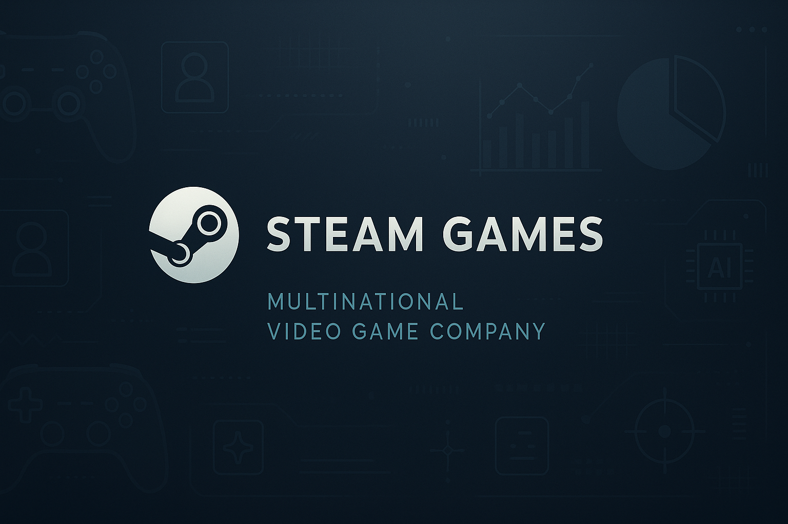
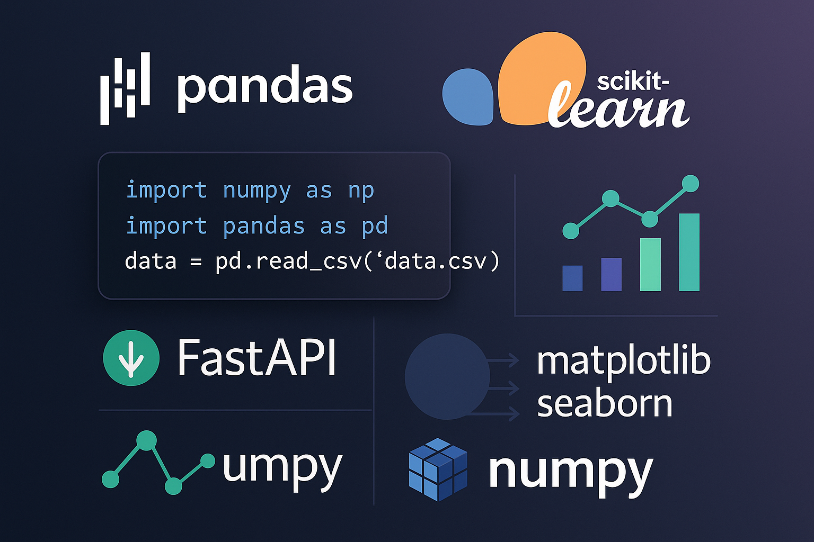

# PROYECTO INDIVIDUAL No 1 - MACHINE LEARNING OPERATIONS

## Multinacional de Video Juegos Steam Games



---

## Introducción

Este proyecto presenta una API desarrollada con FastAPI para servir un modelo de recomendación de videojuegos basado en datos de la plataforma Steam. La API proporciona varios endpoints para consultar información sobre desarrolladores, géneros y recomendaciones de juegos. El proyecto ha sido reestructurado para seguir las mejores prácticas de desarrollo de software, incluyendo una arquitectura modular, manejo de datos eficiente y una clara separación de responsabilidades.

---

## Librerías Utilizadas



---

## Características

- **API de alto rendimiento:** Construida con FastAPI, que ofrece un rendimiento excepcional y una documentación de API interactiva generada automáticamente.
- **Modelo de recomendación:** Utiliza un modelo de similitud de coseno basado en características de los juegos (géneros y desarrolladores) para ofrecer recomendaciones personalizadas.
- **Arquitectura modular:** El código está organizado en una estructura de directorios lógica que separa las rutas, los servicios y el núcleo de la aplicación, facilitando el mantenimiento y la escalabilidad.
- **Gestión de datos eficiente:** Los datos se cargan una sola vez al iniciar la aplicación y se cachean en memoria para un acceso rápido y eficiente en todas las solicitudes.

---

## Estructura del Proyecto

El proyecto sigue una estructura modular para una mejor organización y mantenibilidad:

```
.│
├── app/ # Directorio principal de la aplicación
│ ├── core/ # Núcleo de la aplicación
│ │ ├── __init__.py
│ │ ├── config.py # Configuración de la aplicación
│ │ └── data_handler.py # Carga y cacheo de datos
│ ├── __init__.py
│ ├── main.py # Archivo principal de la aplicación FastAPI
│ ├── models/ # Modelos de datos (Pydantic)
│ │ └── __init__.py
│ ├── routers/ # Definición de los endpoints de la API
│ │ ├── __init__.py
│ │ ├── developers.py
│ │ ├── genres.py
│ │ └── recommendations.py
│ └── services/ # Lógica de negocio
│ ├── __init__.py
│ ├── developers.py
│ ├── genres.py
│ └── recommendations.py
├── combined_data.json.gz # Archivo de datos
├── EDA _steam_games.ipynb # Notebook de análisis exploratorio
├── EDA _user_reviews.ipynb # Notebook de análisis exploratorio
├── EDA_items.ipynb # Notebook de análisis exploratorio
├── README.md # Este archivo
└── requirements.txt # Dependencias del proyecto

```

---

## Cómo Empezar

Sigue estos pasos para configurar y ejecutar el proyecto en tu entorno local.

### Prerrequisitos

- Python 3.8 o superior
- pip (manejador de paquetes de Python)

### Instalación

1. **Clona el repositorio:**

 ```bash
 gh repo clone Caicedito24081982/PROYECTO-INDIVIDUAL-MACHINE-LEARNING
 cd PROYECTO-INDIVIDUAL-MACHINE-LEARNING
 ```

2. **Crea y activa un entorno virtual:**

 ```bash
 python -m venv venv
 source venv/bin/activate # En Windows usa `venv\Scripts\activate`
 ```

3. **Instala las dependencias:**

 ```bash
 pip install -r requirements.txt
 pip install scikit-learn  # Dependencia adicional requerida
 ```

### Ejecución

1. **Inicia la aplicación:**

 ```bash
 uvicorn app.main:app --reload
 ```

2. **Accede a la documentación de la API:**

 Abre tu navegador y visita [http://127.0.0.1:8000/docs](http://127.0.0.1:8000/docs) para ver la documentación interactiva de la API generada por Swagger UI.

---

## Endpoints de la API

A continuación se describen los endpoints disponibles en la API.

### Developers

- **GET /developer/{desarrollador}**

 Devuelve estadísticas sobre un desarrollador específico, incluyendo la cantidad de juegos lanzados y el porcentaje de juegos gratuitos por año.

 **Ejemplo de respuesta:**

 ```json
 {
  "Desarrollador": "Valve",
  "Estadísticas por año": [
  {
  "year": 2012,
  "Estadisticas": {
  "Cantidad de Items": 1,
  "Contenido Free": "0.00%"
  }
  },
  {
  "year": 2013,
  "Estadisticas": {
  "Cantidad de Items": 1,
  "Contenido Free": "0.00%"
  }
  }
  ]
 }
 ```

### Genres

- **GET /user_for_genre/{genero}**

 Devuelve el usuario que más horas ha jugado para un género específico, junto con un desglose de las horas jugadas por año.

 **Ejemplo de respuesta:**

 ```json
 {
  "Usuario con más horas jugadas para Género Action": "Sp33dy",
  "Horas jugadas": [
  {
  "year": 2010,
  "Horas": 12345
  },
  {
  "year": 2011,
  "Horas": 54321
  }
  ]
 }
 ```

### Recommendations

- **GET /recomendacion_juego/{product_id}**

 Devuelve una lista de 5 juegos recomendados basados en un juego de entrada.

 **IDs válidos para probar:**
 - 761140, 643980, 670290, 767400, 772540

 **Ejemplo de respuesta:**

 ```json
 [
  {
  "id": 123,
  "title": null
  },
  {
  "id": 456,
  "title": null
  }
 ]
 ```

---

## Contribuciones

Las contribuciones son bienvenidas. Si deseas contribuir a este proyecto, por favor sigue los siguientes pasos:

1. Haz un fork del repositorio.
2. Crea una nueva rama para tu feature (`git checkout -b feature/nueva-feature`).
3. Haz commit de tus cambios (`git commit -am 'Añade nueva feature'`).
4. Haz push a la rama (`git push origin feature/nueva-feature`).
5. Abre un Pull Request.

---

## Alumno

- **Jorge Enrique Caicedo Riascos** - [Caicedito24081982](https://github.com/Caicedito24081982)

